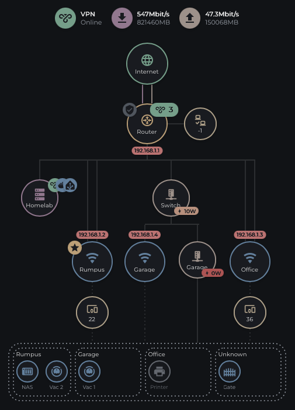

# Network Flow Card

[](https://github.com/hacs/integration)
[](LICENSE)

A [power-flow-card-plus](https://github.com/flixlix/power-flow-card-plus)-style
Lovelace card for Home Assistant — but for your **network** instead of your
energy dashboard. Visualize Internet → Router → LAN / Wi-Fi Access Points →
Individual Devices as a live, animated topology diagram, built entirely from
your existing sensors and device trackers.

> Inspired by the excellent [power-flow-card-plus](https://github.com/flixlix/power-flow-card-plus)
> by [flixlix](https://github.com/flixlix) — see [Credits](#credits) below.



> Replace the image above with your own screenshot — see
> [Contributing](#contributing) for suggestions on what to include.

## Features

- **Internet node** — ping, jitter, download/upload speed with animated flow
  lines, lifetime data totals, a billing-cycle progress ring, and offline
  detection (pulsing "!" icon, line markers) when its entity goes
  unavailable.
- **Router node** — fully optional. Leave its entity blank and it (and the
  LAN node hanging off it) disappear automatically, with Internet's
  download/upload lines connecting straight down into the Access Point
  layer instead.
- **LAN node** — a simple connected-devices count hanging off the Router.
- **Unlimited Access Points** — each with its own entity, icon, size,
  download/upload lines, and an optional connected-devices sub-circle.
  Mark one AP as **Primary**, and set a **Backhaul Type** entity per
  non-primary AP to automatically switch its uplink line between solid
  (wired) and dashed (wireless/mesh).
- **Individual Devices** — group any number of arbitrary trackers
  (phones, laptops, IoT, whatever you like) into a dashed, auto-sizing box
  beneath the diagram, each showing online/offline state.
- **Offline-aware everywhere** — every node (Internet, Router, LAN, each
  AP, each AP's device count) independently detects `unavailable` /
  `unknown` / `off` states and reflects it with a pulsing warning icon,
  dimmed colors, and "X" markers on the flow lines feeding it.
- **Smart single-AP layout** — with exactly one Access Point configured,
  the card automatically collapses the T-bar/bus-line so the upstream node
  connects directly to that AP, instead of drawing a pointless one-branch
  fan-out.
- **Configurable summary badges** — download/upload/ping/jitter shown as
  colored badge rows, positionable at the top, bottom, left, or right of
  the diagram.
- **Deeply customizable colors** — every icon, circle outline, and line has
  its own color field, and every field accepts either a hex value or a
  Home Assistant theme variable (e.g. `var(--accent-color)`).
- **[card_mod](https://github.com/thomasloven/lovelace-card-mod) compatible**
  out of the box — target `.circle`, `.flow-dot`, `.branches`, etc.
  directly.
- **Full visual GUI editor** — every option above is configurable without
  touching YAML, including a dedicated Access Points list with add/edit/
  remove, and an Individual Devices list.

## Installation

### HACS (recommended)

This card isn't in the HACS default store — add it as a **custom
repository**:

1. In Home Assistant, go to **HACS → ⋮ (top right) → Custom repositories**.
2. Add this repository's URL, set the category to **Dashboard**.
3. Find **Network Flow Card** in HACS and click **Download**.
4. Add the resource if HACS doesn't do it automatically:
   **Settings → Dashboards → ⋮ → Resources**:
   - URL: `/hacsfiles/network-flow-card/network-flow-card.js`
   - Type: `JavaScript Module`
5. Hard-refresh your browser (Ctrl/Cmd+Shift+R).

### Manual installation

1. Download `network-flow-card.js` from the
   [latest release](../../releases/latest).
2. Copy it to `config/www/network-flow-card.js`.
3. **Settings → Dashboards → ⋮ → Resources** → add
   `/local/network-flow-card.js` as a `JavaScript Module`.
4. Hard-refresh your browser.

> **Updating manually?** Home Assistant caches Lovelace resources by URL.
> If changes don't appear after replacing the file, bump the resource URL
> with a version query string, e.g. `/local/network-flow-card.js?v=2`.

## Adding the card

**Settings → Dashboards → [your dashboard] → Edit → Add Card → search
"Network Flow Card"**, or add manually via YAML:

```yaml
type: custom:network-flow-card
```

Then use the visual editor to select your entities — start with
**Internet**, then **Router** (optional), **LAN Connections** (optional),
and **Access Points**.

## Example configuration

```yaml
type: custom:network-flow-card
title: Network
internet:
  entity: sensor.internet_status
  icon: mdi:web
  entities:
    ping: sensor.speedtest_ping
    jitter: sensor.speedtest_jitter
    download: sensor.speedtest_download
    upload: sensor.speedtest_upload
    total_download: sensor.nbn_downloaded
    total_upload: sensor.nbn_uploaded
    billing_total: sensor.nbn_billing_cycle_length
    billing_remaining: sensor.nbn_billing_cycle_remaining
  colors:
    circle: "#4caf50"
    download: "#3b82f6"
    upload: "#f7931a"
router:
  entity: sensor.router_status
  icon: mdi:router-network
lan:
  entity: sensor.lan_connected_devices
access_points:
  - entity: sensor.lounge_ap_status
    name: Lounge
    icon: mdi:wifi
    is_primary: true
    entities:
      connected_devices: sensor.lounge_ap_devices
      download: sensor.lounge_ap_download
      upload: sensor.lounge_ap_upload
  - entity: sensor.garage_ap_status
    name: Garage
    icon: mdi:wifi
    entities:
      connected_devices: sensor.garage_ap_devices
      download: sensor.garage_ap_download
      upload: sensor.garage_ap_upload
      backhaul_type: sensor.garage_ap_backhaul_type
individual_devices:
  - entity: device_tracker.phone_1
    icon: mdi:cellphone
  - entity: device_tracker.laptop_1
    icon: mdi:laptop
show_summary: true
animation: true
```

This is a small slice of the available options — the visual editor exposes
everything (colors, sizes, summary position, offline colors, etc.) without
needing to hand-write YAML.

## Theming & card_mod

Every color field accepts a Home Assistant theme variable directly, e.g.
`var(--accent-color)`, so the card can follow your theme automatically.

For deeper styling,
[card_mod](https://github.com/thomasloven/lovelace-card-mod) works with no
special setup:

```yaml
type: custom:network-flow-card
entities: ...
card_mod:
  style: |
    ha-card {
      box-shadow: none !important;
      border: none !important;
    }
    .circle {
      box-shadow: 0 2px 6px rgba(0,0,0,0.2) !important;
    }
```

## Known limitations

- This card loads [Lit](https://lit.dev) from a CDN (`unpkg.com`) at
  runtime rather than bundling it locally. This keeps the file small and
  simple to maintain, but means the card requires outbound internet access
  from the browser and depends on `unpkg.com` staying available. A fully
  bundled, offline-capable build is on the roadmap for a future release.
- LAN's node currently hangs directly off Router's circle for positioning;
  if Router is hidden (no entity set), LAN hides with it.

## Credits

The visual style of this card — circular nodes, animated flow lines, and
the overall "distribution diagram" concept — was inspired by
[power-flow-card-plus](https://github.com/flixlix/power-flow-card-plus) by
[flixlix](https://github.com/flixlix), an excellent card for visualizing
Home Assistant's Energy Dashboard. Network Flow Card is an independent
implementation built specifically for network topology (Internet, Router,
Access Points, connected devices) rather than power distribution, and
shares no code with the original — but the idea of representing live data
as an animated node-and-line diagram is very much indebted to that
project. If you like this card, consider checking out (and starring)
power-flow-card-plus too.

## Contributing

Issues and pull requests are welcome. If you're filing a bug, a screenshot
of your rendered card plus your YAML config (with entity IDs redacted if
you'd like) helps a lot.

## License

[MIT](LICENSE)
