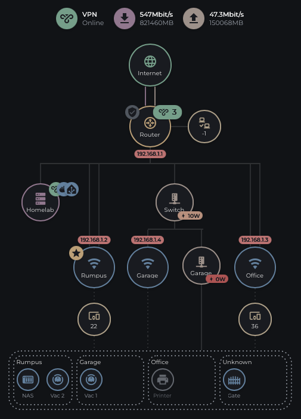
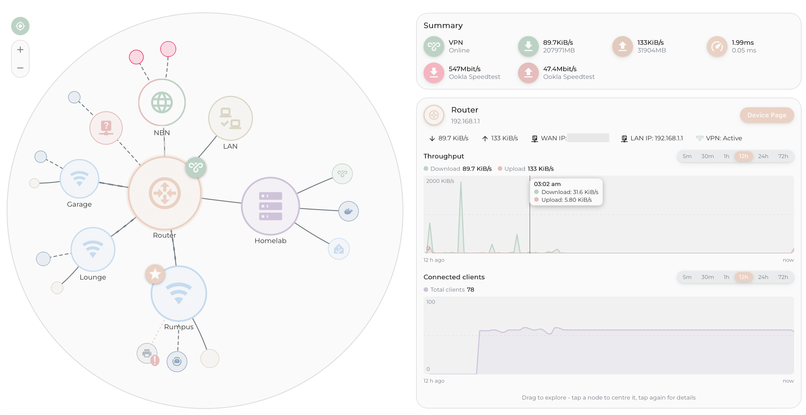

# Network Flow Card

[](https://github.com/hacs/integration)
[](LICENSE)

A [power-flow-card-plus](https://github.com/flixlix/power-flow-card-plus)-style
Lovelace card for Home Assistant - but for your **network** instead of your
energy dashboard. See Internet → Router → Switches / Access Points → Clients as
a live topology of your own network, built from the sensors and device trackers
you already have, and open any device to see its details and history.

> Inspired by the excellent [power-flow-card-plus](https://github.com/flixlix/power-flow-card-plus)
> by [flixlix](https://github.com/flixlix) - see [Credits](#credits) below.





- [Highlights](#highlights)
- [Two ways to see your network](#two-ways-to-see-your-network)
- [Installation](#installation)
- [Getting started](#getting-started)
- [What you can put on the card](#what-you-can-put-on-the-card)
- [The details panel](#the-details-panel)
- [Auto-Discovery and supported integrations](#auto-discovery-and-supported-integrations)
- [Configuration](#configuration)
- [Theming and card_mod](#theming-and-card_mod)
- [Known limitations](#known-limitations)
- [Credits](#credits)

A step-by-step guide to every page of the editor is in [HOWTO.md](HOWTO.md).

## Highlights

- **Two views** - the classic animated **Flat** diagram, and an explorable,
  zoomable **Hyperbolic** tree of the whole network.
- **A details panel for every device** - live throughput, addresses, clients,
  PoE ports, VMs and containers, CPU and memory, and history graphs with their
  own timescale buttons. It can sit beside the diagram or slide up as a pop-up.
- **Auto-Discovery** - scan a supported integration from the editor and pick
  from what it finds, instead of entering every entity by hand. Nothing is ever
  applied without your selection.
- **Everything optional** - Router, Core Switch, Security badges, Monitoring,
  PoE, Servers: leave an entity blank and that part simply isn't drawn.
- **Offline-aware** - every node detects when it is down and says so, with a
  warning marker, dimmed colours, and an "X" on the line feeding it.
- **Fully configurable without YAML** - a visual editor covers every option, and
  every colour accepts a hex value or a Home Assistant theme variable.
- **Built for real networks** - unlimited tiers of switches and access points,
  a Secondary Internet for a backup line, a Card Size control for phone screens.

## Two ways to see your network

Choose with the two tiles at the top of the editor's **Layout** (or **Discover**)
page, or in YAML with `view_mode`.

### Flat

The original diagram: Internet at the top, down through Router and Core Switch
to a bus of Nodes (access points, switches, servers), with Clients in a box
beneath. Flow lines animate with traffic. Turn on **Show Details Panel** and a
summary card and the details panel appear beside it (tablet) or above it (phone);
tap a circle to see its details, and tap it again to open it.

### Hyperbolic

The whole network as a tree on a Poincare disk, with the Router at the centre.
Everything near the centre is large and readable; everything farther away shrinks
toward the edge. Drag to pan, pinch or use **+ / -** to zoom, tap a node to bring
it to the centre, and tap it again to open it. Clients attach to the access point
or switch they are connected to, or collect in groups. Nodes that are offline get
a "!" badge and a dotted line. Options include frosted **Glass style**, per-type
node sizes, and a layout that adapts to phone or tablet.

## Installation

### HACS (recommended)

This card isn't in the HACS default store - add it as a **custom
repository**:

1. In Home Assistant, go to **HACS → ⋮ (top right) → Custom repositories**.
2. Add this repository's URL, set the category to **Dashboard**.
3. Find **Network Flow Card** in HACS and click **Download**.
4. Add the resource if HACS doesn't do it automatically:
   **Settings → Dashboards → ⋮ → Resources**:
   - URL: `/hacsfiles/network-flow-card/network-flow-card.js`
   - Type: `JavaScript Module`
5. Hard-refresh your browser (Ctrl/Cmd+Shift+R).

### Manual installation

1. Download `network-flow-card.js` from the
   [latest release](../../releases/latest).
2. Copy it to `config/www/network-flow-card.js`.
3. **Settings → Dashboards → ⋮ → Resources** → add
   `/local/network-flow-card.js` as a `JavaScript Module`.
4. Hard-refresh your browser.

> **Updating manually?** Home Assistant caches Lovelace resources by URL.
> If changes don't appear after replacing the file, bump the resource URL
> with a version query string, e.g. `/local/network-flow-card.js?v=4`.

**Requirements:** Home Assistant 2023.4 or later. The details panel's history
graphs need the sensors to be recorded by Home Assistant's recorder.

## Getting started

**Settings → Dashboards → [your dashboard] → Edit → Add Card → search
"Network Flow Card"**, or add it in YAML:

```yaml
type: custom:network-flow-card
```

Open the visual editor, then either:

- **Discover** - tap the Discover entry at the top of the menu and scan the
  integrations you use. Review each list, **Select** what you want, and the card
  fills itself in. Or
- **Set it up by hand**, in this order: **Internet**, then **Router/Gateway**
  (optional), **Core Switch** (optional), **Nodes** for your access points,
  switches and servers, and **Clients**.

Then try the **Layout** page: switch the view between Flat and Hyperbolic, turn on
the details panel, and choose what the Summary shows.

## What you can put on the card

| Element | What it is |
|---|---|
| **Internet** | ping, jitter, download / upload speed (from a speed test), lifetime data totals, a quota ring for a billing cycle, offline detection. A **Secondary Internet** (a backup line or a genuine second connection) can be Active/Active or Active/Standby; in standby it is dashed and switches to solid the moment the primary goes down. |
| **Router/Gateway** | optional. Its **Download / Upload Speed Entity** feed the Real-time Download / Upload summary items; WAN, Secondary WAN and LAN addresses; a LAN Connected Clients count. |
| **Core Switch** | optional, between Router and the bus, with its own Connected Clients count, an IP address pill and full PoE support. |
| **Nodes** | the bus below is made of Nodes, freely reordered. A Node is a plain **Access Point**; a standalone **Switch**; a Switch feeding **Access Points, other Switches and/or Servers** to any depth; or a **Server** (a box running several network functions - DNS filter, VPN, reverse proxy) with any number of Containers / VMs as status badges. An Access Point can itself feed further items (a wireless mesh). Mark one AP **Primary**, and a **Backhaul Type** entity switches its uplink between solid (wired) and dashed (wireless / mesh). |
| **Clients** | any number of device trackers in an auto-sizing box (or, in the Hyperbolic view, attached to the device they are on), each showing online / offline. Group them by SSID, VLAN, Connected Device or Device Area, and let the sub-groups share the box evenly. Clients on a guest network get a badge automatically. |
| **Monitoring** | Uptime Kuma, Ping, Gatus and UptimeRobot services as their own circles with an up / down / pending / maintenance badge: **External** (a dashed box above Internet), **Internal** (in the Clients box, or as a badge on any device already on the card) or **Auto**. An optional response-time badge colours by threshold. |
| **Security** | VPN, Firewall, DNS Filtering and Reverse Proxy badges, each pointed at the Router/Gateway, Core Switch, Primary AP or a Server. A Server can choose which of them it shows. |
| **PoE** | a summed wattage badge on the Router, Core Switch, any Switch, Access Point or Server - sourced automatically from the device's PoE entities or from a list you choose, with one colour or up to three thresholds. A **PoE Total** summary item adds them all up. |
| **IP addresses** | pills for the Router (WAN and LAN), access points, managed switches and servers. |
| **Summary** | a card of up to six items: Speed test Download / Upload, Real-time Download / Upload, Latency and Jitter, VPN Status, Firewall Status, PoE Total. Each speed, real-time and latency item has its own badge and icon colours. |

Every node detects `unavailable` / `unknown` / `off` / `down` (and `not_home` for
device trackers) and shows it. Badges can be placed in any corner of their circle,
and one **Flow Line Color** controls every connection line and flow dot at once.

## The details panel

Select a node (in the Hyperbolic view, or the Flat view with **Show Details Panel**
on) and its panel shows what the card knows about it:

| For | You get |
|---|---|
| Any node | state, a **Device Page** (or **More Info**) button, live throughput, IP addresses, VPN / firewall / DNS state, and - where the device reports them - CPU, RAM, temperature, traffic, PoE power, ports up, uptime, firmware and model |
| A device with clients | the **Clients** list, online first; tap one to jump to it |
| A switch | its **PoE Ports**, with the watts each is delivering |
| A client | **Client Info** - connected to, IP, MAC, SSID, VLAN, last online, signal and more - and its own Download / Upload graph if its tracker keeps speed attributes (such as `down_speed` / `up_speed`) or its device has speed sensors |
| A server | CPU, memory, disk, uptime and network readings, and a **Services** list of its VMs and containers headed by a total such as "11 of 12 online" |
| A VM or container | CPU, memory and disk readings and a CPU / Memory graph |

**History graphs** - Throughput, Latency, Connected clients, Response time and
Resources - read Home Assistant's recorder and follow live readings as they arrive.
Each has its own timescale (5m, 30m, 1h, 12h, 24h, 72h), remembered on that device,
and a colour for each series.

**Show as Pop-up** replaces the panel with a sheet that slides up from the bottom
when you tap a node - on a phone, or on a tablet where the summary then moves to
the top and the diagram fills the card.

## Auto-Discovery and supported integrations

Every scan shows a list to review and select from - nothing is applied
automatically. A discovered Access Point, Switch or Server can be attached under
any Switch or Access Point already in your tree, at any depth, instead of always
creating a new top-level Node. Every list has a keyword search and an integration
filter. The **Experimental** column reflects real-world testing, not technical
confidence: an integration can be well understood from its own source and still be
marked experimental because it hasn't seen much use yet.

| Integration | Discovers | Experimental |
|---|---|:---:|
| TP-Link Router | Router/Gateway, Real-time Speed | |
| TP-Link Deco | Router/Gateway (master unit), Nodes (satellites, as Access Points), Clients | |
| TP-Link Omada | Router/Gateway, Nodes (switches & APs), Clients | ✅ |
| UniFi Network | Router/Gateway, Nodes (switches & APs), Clients | ✅ |
| UniFi Network Map | Router/Gateway, Nodes (switches & APs), Clients | ✅ |
| UniFi Device Info | Router/Gateway (with its WAN sensor), Nodes (switches & APs, with their addresses), Clients | ✅ |
| AsusRouter (AiMesh) | Router/Gateway, Real-time Speed, Secondary WAN IP, Nodes (satellites, as Access Points), Clients | ✅ |
| MikroTik | Router/Gateway, Nodes (as an Access Point), Clients | ✅ |
| MikroTik Router | Router/Gateway, Real-time Speed, Nodes (as an Access Point), Clients | ✅ |
| MikroTik Extended | Router/Gateway, Real-time Speed, WAN IP, Nodes (as an Access Point), Clients | ✅ |
| OPNsense | Router/Gateway, Real-time Speed, Security (DNS Filtering, via Unbound Blocklist), Internet (built-in speed test), Clients | ✅ |
| ASUSWRT | Router/Gateway, Real-time Speed, Clients | ✅ |
| FRITZ!Box | Router/Gateway, Real-time Speed | ✅ |
| pfSense | Router/Gateway, Real-time Speed | ✅ |
| OpenWrt (LuCI) | Router/Gateway (via a client-tracker proxy), Clients | ✅ |
| ha-openwrt | Router/Gateway, Real-time Speed, WAN IP, Nodes (as an Access Point), Clients | ✅ |
| Synology SRM | Router/Gateway (via a client-tracker proxy, best-effort) or Nodes (as an Access Point), Clients | ✅ |
| Netgear (Orbi, Nighthawk, ...) | Router/Gateway (via a client-tracker proxy) or Nodes (as an Access Point), Clients | ✅ |
| Proxmox VE | Nodes (as Server nodes, with VMs/Containers attached) | |
| Portainer | Containers/VMs | |
| AdGuard Home | Security (DNS Filtering) | ✅ |
| Uptime Kuma | Monitoring | |
| Gatus | Monitoring | |
| UptimeRobot | Monitoring | |
| Ping (Home Assistant core) | Monitoring | |
| Speedtest.net | Internet (Ping, Download, Upload) | |
| Ookla Speedtest | Internet (Ping, Download, Upload, Jitter, ISP) | |
| Cloudflare Speed Test | Internet (latency, 90th-percentile Download/Upload) | ✅ |
| LibreSpeed | Internet (Ping, Download, Upload, Jitter) | ✅ |
| Fast.com | Internet (Download only - the only figure it measures) | ✅ |
| Home Assistant Mobile App | Clients (every device running the Companion app) | ✅ |
| Aussie Broadband | Internet (billing cycle, data usage) | |
| Starlink | Internet (session data usage, connectivity) | ✅ |
| Start.ca | Internet (billing cycle, data usage) | ✅ |

## Configuration

The visual editor exposes everything; YAML is only needed if you prefer it. A
small slice:

```yaml
type: custom:network-flow-card
title: Network
view_mode: hyperbolic          # flat (default) | hyperbolic
internet:
  entity: sensor.internet_status
  icon: mdi:web
  entities:
    ping: sensor.speedtest_ping
    jitter: sensor.speedtest_jitter
    download: sensor.speedtest_download
    upload: sensor.speedtest_upload
    quota_total: sensor.nbn_billing_cycle_length
    quota_remaining: sensor.nbn_billing_cycle_remaining
router:
  entity: sensor.router_status
  icon: mdi:router-network
  entities:
    wan_ip: sensor.router_wan_ip
    lan_ip: sensor.router_lan_ip
nodes:
  - name: ""
    switch: null
    access_points:
      - entity: sensor.lounge_ap_status
        name: Lounge
        icon: mdi:wifi
        is_primary: true
        entities:
          connected_devices: sensor.lounge_ap_clients
  - name: "Core Switch"
    switch:
      entity: sensor.core_switch_status
      entities:
        connected_devices: sensor.core_switch_clients
        ip_address: sensor.core_switch_status
    access_points:
      - entity: sensor.bedroom_ap_status
        name: Bedroom
        icon: mdi:wifi
individual_devices:
  - entity: device_tracker.phone_1
    icon: mdi:cellphone
show_summary: true
summary_items: [realtime_download, realtime_upload, ping]   # up to 6
show_ip_addressing: true
enable_animations: true           # off by default
flow_line_color: "var(--divider-color, #ccc)"
```

Configuration keys keep their original names even where the editor's wording has
changed: "Clients" is `individual_devices`, "Connected Clients" is
`connected_devices`, and "Server" is `homelab` / `homelabs`. Older configurations
using the flat `access_points:` array keep working - they are migrated
automatically.

### View and details panel options

| Option | What it does |
|---|---|
| `view_mode` | `flat` or `hyperbolic` |
| `flat_show_details` / `hyperbolic_show_details` | the details panel in each view |
| `hyperbolic_details_popup` | show the panel as a pop-up sheet |
| `hyperbolic_details_button` | the header button: `device` (the device's page in Settings) or `more-info` |
| `hyperbolic_show_graphs`, `hyperbolic_graph_range` | history graphs, and the default timescale (`5m` … `72h`) |
| `hyperbolic_show_clients` | the Clients, Services and PoE Ports lists |
| `hyperbolic_layout` | `auto`, `mobile` or `tablet` arrangement |
| `hyperbolic_fit_height`, `hyperbolic_tablet_split` | tablet: size the tree to the screen height, or set its width |
| `hyperbolic_client_layout` | `attached` to their device, or `grouped` |
| `summary_position` | `top` or `bottom` |
| `individual_devices_group_layout` | Clients sub-group widths: `gaps`, `last_fill`, `widest_fits` or `even` (all the same width) |
| `hyperbolic_node_scale`, `hyperbolic_size_*` | node sizes (all, and per type) |
| `hyperbolic_outline_*`, `hyperbolic_background_*`, `hyperbolic_glass*` | tree circle colours and the frosted glass style |
| `hyperbolic_offline_badge_color`, `hyperbolic_offline_line_color` | the "!" badge and dotted line of an offline node |
| `hyperbolic_details_*_color`, `hyperbolic_summary_*` | details panel and summary card colours |
| `summary_*_color` (with `…_icon_color`) | summary badge colours: `summary_speedtest_download`, `summary_speedtest_upload`, `summary_realtime_download`, `summary_realtime_upload`, `summary_latency` |
| `hyperbolic_graph_<name>_color` | graph series colour; `<name>` is `download`, `upload`, `ping`, `jitter`, `clients`, `response`, `cpu`, `memory` or `disk` |

### Per-device options

| Option | Where | What it does |
|---|---|---|
| `entities.ip_address`, `ip_badge_color`, `ip_badge_icon_color` | Core Switch, Switches, Servers | the address entity (or an entity with an `ip` / `ip_address` attribute) and the pill's colours |
| `entities.services_total`, `entities.services_running` | Servers | count sensors for the "x of y online" heading |
| `guest_label` | Servers | a Home Assistant label put on the server's VMs and containers |

## Theming and card_mod

Every colour field accepts a Home Assistant theme variable directly, e.g.
`var(--accent-color)`, so the card can follow your theme automatically. Corner
radius and shadows on the summary and details panel follow `--border-radius` and
`--box-shadow` if your theme defines them.

For deeper styling,
[card_mod](https://github.com/thomasloven/lovelace-card-mod) works with no
special setup (the [how-to guide](HOWTO.md#12-styling-with-card_mod) has a table of class names and
ready-made examples - dashed lines, shadows, hiding text and more):

```yaml
type: custom:network-flow-card
card_mod:
  style: |
    ha-card {
      box-shadow: none !important;
      border: none !important;
    }
    .circle {
      box-shadow: 0 2px 6px rgba(0,0,0,0.2) !important;
    }
    .hyp-summary,
    .hyp-details {
      box-shadow: var(--box-shadow);
    }
```

`.circle` styles the Flat view's circles; `.hyp-summary` and `.hyp-details` are the
summary card and details panel.

## Known limitations

- Auto-Discovery never knows which switch physically feeds which switch or AP - no
  supported integration exposes that uplink topology to Home Assistant - so
  discovered items are flat lists. Use the attach-to-existing option on the Nodes
  and Clients discovery lists, or the Node editor, to place one under another by
  hand. Netgear's integration never distinguishes a satellite, switch or AP from an
  ordinary client, so its devices only ever show up as Clients.
- Each Security item (VPN, Firewall, DNS Filtering, Reverse Proxy) has one entity; a
  Server can choose whether to show it, not point it at a different entity.
- LAN's node hangs directly off Router's circle for positioning; if Router is
  hidden (no entity set), LAN hides with it.
- Fit to Width and Scaled / Compact sizing rely on CSS `zoom`, supported by every
  Chromium/WebKit-based browser and Firefox 126+.
- Monitoring's Type: Auto can only classify a service by its tags, the address it
  checks, or (Gatus only) a keyword in its name; an ambiguous service defaults to
  Internal (External for UptimeRobot) and may need its Type set by hand.
- The Hyperbolic view and details panel need a browser with CSS `color-mix()`
  support (every current browser). The pop-up sheet also needs the `<dialog>`
  element (iOS 15.4 and later).
- History graphs only show sensors that Home Assistant records. A client's own
  Throughput graph needs its tracker to keep speed attributes, and loads attribute
  history, which is heavier on long timescales.
- A server's "x of y online" count can only include VMs and containers the card can
  find: ones its integration links to it, count sensors on its device, count
  entities you choose, or ones carrying a label you give it. No integration links a
  server to guests of a different integration.

## Credits

The visual style of this card - circular nodes, animated flow lines, and the
overall "distribution diagram" concept - was inspired by
[power-flow-card-plus](https://github.com/flixlix/power-flow-card-plus) by
[flixlix](https://github.com/flixlix), an excellent card for visualizing Home
Assistant's Energy Dashboard. Network Flow Card is an independent implementation
built specifically for network topology rather than power distribution, and shares
no code with the original - but the idea of representing live data as an animated
node-and-line diagram is very much indebted to that project. If you like this card,
consider checking out (and starring) power-flow-card-plus too.

## Contributing

Issues and pull requests are welcome. If you're filing a bug, a screenshot of your
rendered card plus your YAML config (with entity IDs redacted if you'd like) helps
a lot.

## License

[MIT](LICENSE)
